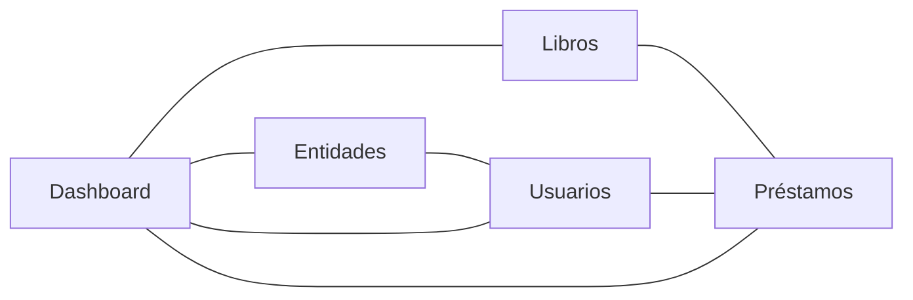
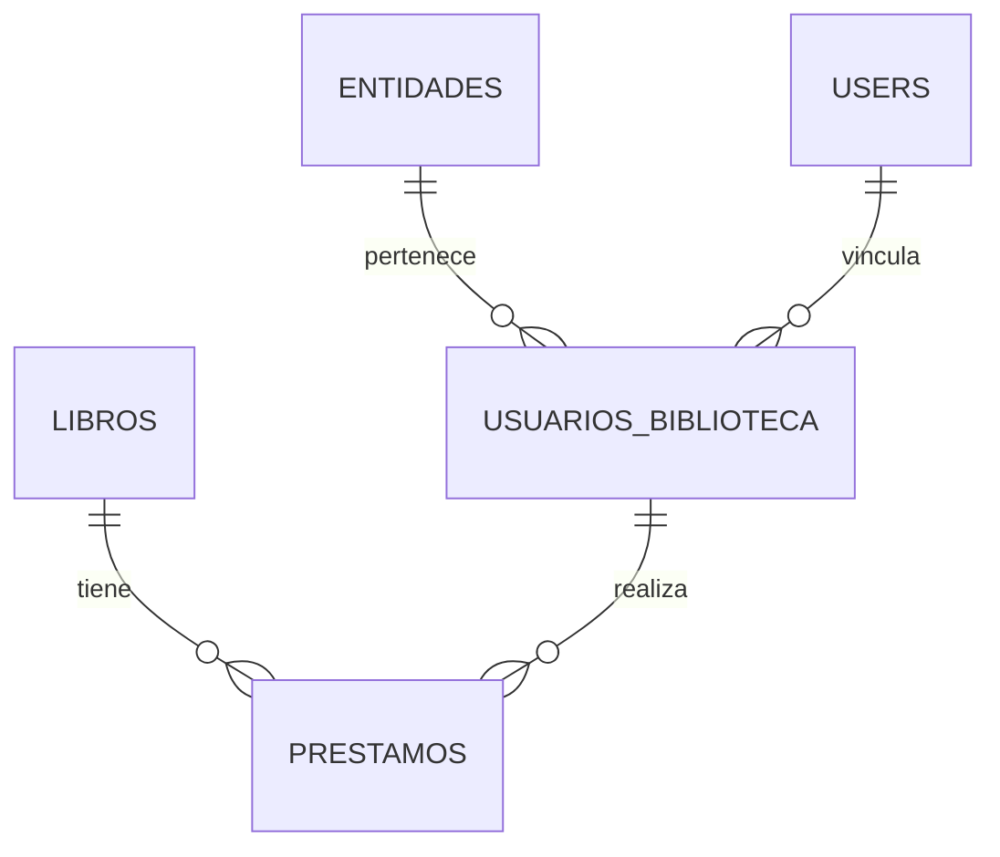

 # 📚 Sistema de Gestión de Biblioteca

## Descripción
esta es mi prueba tecnica y es...

Sistema integral para la gestión de biblioteca, desarrollado con Laravel (backend) y React + Inertia.js (frontend). Permite administrar libros, usuarios, préstamos y entidades (colegios, universidades, empresas, naturales), con dashboard interactivo, gráficas, búsqueda avanzada.

---

## 🚀 Instalación

### **Requisitos previos**
- PHP >= 8.1
- Composer
- Node.js >= 18.x y npm >= 9.x
- Base de datos (MySQL, PostgreSQL o SQLite)
- Extensiones PHP: pdo, mbstring, openssl, etc.

### **Pasos de instalación**

1. **Clona el repositorio**
   ```bash
   git clone https://github.com/George21G/PruebaDesarrollo.git
   ```

2. **Instala dependencias de backend**
   ```bash
   composer install
   ```

3. **Instala dependencias de frontend**
   ```bash
   npm install
   ```

4. **Copia y configura el archivo de entorno**
   ```bash
   cp .env.example .env
   # Edita .env con tus credenciales de base de datos y correo
   ```

5. **Genera la clave de la aplicación**
   ```bash
   php artisan key:generate
   ```

6. **Configura la base de datos**
   - Crea una base de datos vacía y actualiza `.env` con los datos de conexión.

7. **Ejecuta las migraciones y seeders**
   ```bash
   php artisan migrate --seed
   ```

8. **Compila los assets de frontend**
   ```bash
   npm run build
   # Para desarrollo puedes usar:
   npm run dev
   ```

9. **Inicia el servidor**
   ```bash
   php artisan serve
   # Accede a http://127.0.0.1:8000
   ```

---

## 🗂️ Estructura del Proyecto

```
├── app/Http/Controllers/      # Controladores de Laravel
├── app/Models/                # Modelos Eloquent
├── database/migrations/       # Migraciones de base de datos
├── database/seeders/          # Seeders de datos de prueba
├── resources/js/              # Frontend React + Inertia
│   ├── pages/                 # Páginas principales (SPA)
│   ├── components/            # Componentes reutilizables
│   └── layouts/               # Layouts generales
├── routes/web.php             # Rutas principales
├── public/                    # Archivos públicos
└── ...
```

---

## 🖥️ Diagrama de Arquitectura General

```mermaid
graph TD
    subgraph Frontend (React + Inertia)
        A[Usuario Navegador] --> B[React SPA]
    end
    subgraph Backend (Laravel)
        B --> C[Inertia Controller]
        C --> D[Modelos Eloquent]
        D --> E[Base de Datos]
    end
    C -->|JSON| B
    B -->|Petición HTTP| C
```

---

## 🔄 Diagrama de Flujo CRUD (Ejemplo: Libros)

```mermaid
flowchart TD
    U[Usuario] -->|Clic en "Agregar Libro"| F[Formulario React]
    F -->|POST /books| API[Laravel Controller]
    API -->|Valida y guarda| DB[(Base de Datos)]
    DB -->|Respuesta| API
    API -->|Redirige y muestra mensaje| F
```

---

## 📊 Diagrama de Módulos y Relaciones



---

## 🗃️ Diagrama Entidad-Relación (ER) Simplificado



---

## 📝 Notas adicionales

- El sistema soporta autenticación, roles y protección CSRF.
- El dashboard muestra gráficas en tiempo real usando Recharts.
- El frontend es completamente SPA, con modales y navegación fluida.
- Incluye seeders para datos de prueba y comandos para limpieza/migración de datos.
- Puedes personalizar los módulos y la estructura según las necesidades de tu biblioteca.

---

## 📬 Contacto y soporte

Para dudas, soporte o contribuciones, contacta a jorge robles 